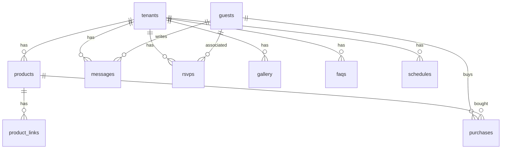

# Project Overview: WeddingGift

WeddingGift is a self-hosted, multi-tenant SaaS application tailored for wedding couples to set up custom landing pages, wedding gift lists, honeymoon quotas, RSVP lists, and interactive guest photo galleries. Gift purchases are processed directly as PIX payments or linked to external store products, with the couple receiving funds instantly and natively.

---

# Business Purpose

Wedding couples face complex challenges in receiving multiple duplicate physical gifts, paying steep commission percentages to commercial list platforms, and managing RSVP logs manually. 

WeddingGift addresses this by:
* **Commission-Free Cash Gifts:** Allowing direct peer-to-peer cash transfers (via PIX/Mercado Pago webhooks) directly to the couple without middleman fees.
* **Consolidated RSVP & FAQ Management:** Centralizing dynamic guest lists, companion groups, dietary restrictions, and visual timelines of the event.
* **Collaborative Interactive Memory:** Allowing guests to post photos directly to a shared gallery during or after the wedding.
* **Theme Styling & Customization:** Empowering couples to configure custom fonts, backgrounds, ambient effects (hearts, butterflies, snow, confetti, gold dust), and custom color systems that dynamically adjust the client interface theme.

---

# Tech Stack

* **Frontend Framework:** Vue 3 (using composition API with `<script setup>`), TypeScript, Pinia (State Management), Vue Router.
* **Styling:** Tailwind CSS, custom dynamic HSL/Hex theme generation injected into the document root.
* **Component Primitives:** `reka-ui` (formerly `radix-vue` v2), `class-variance-authority`, `tailwind-merge`, `vaul-vue`.
* **Backend Database & BaaS:** Appwrite (Self-Hosted), including:
  * **Appwrite Database:** Collections with collection-level and document-level security rules.
  * **Appwrite Storage:** File buckets storing guest avatars, product images, and gallery photos.
  * **Appwrite Auth:** Authentication using email/password and Google OAuth2.
  * **Appwrite Functions (Node 16.0 runtime):**
    * `ai-helper`: Gemini AI generator for thanks notes & Serper Shopping search proxy.
    * `cascade-delete`: Handles absolute cleanups of guest references (rsvps, messages, purchases) upon deletion.
    * `mercado-pago-webhook`: Listens to payment notifications to automatically toggle cash/subscription statuses.
* **Utilities:** `dayjs` (date/time parsing and formatting), `dompurify` (client-side HTML sanitization), `browser-image-compression` (image sizing/weight optimization), `qrcode-pix` (automatic PIX payment payloads).

---

# Repository Structure

```text
WeddingGift/
├── .antigravity/                   # IDE configuration files
├── appwrite.json                   # Appwrite system configuration (collections, buckets, functions metadata)
├── biome.json                      # Biome format & lint configurations
├── components.json                 # Shadcn-vue components schema
├── dist/                           # Compiled production build directory
├── functions/                      # Appwrite serverless functions
│   ├── ai-helper/                  # Gemini & Serper Shopping integration proxy
│   ├── cascade-delete/             # Automatic delete cascading for guests/tenants
│   └── mercado-pago-webhook/       # Automated webhook payment hooks
├── package.json                    # Project dependencies and script commands
├── tailwind.config.js              # Tailwind style tokens
├── tsconfig.json                   # TypeScript project configuration
├── vite.config.ts                  # Vite build tool and development proxy configurations
└── src/                            # Application source files
    ├── main.ts                     # App initialization and store mounting
    ├── App.vue                     # Main App container
    ├── index.css                   # Main tailwind base styling
    ├── components/                 # Vue components
    │   ├── ui/                     # Primitives (button, card, dialog, input, etc.)
    │   ├── reusable/               # Page widgets (DatePicker, Combobox, CookieConsent, PlanLimitAlert)
    │   └── public/                 # Couple template sections (RsvpMessageSection, GallerySection, FaqSection, etc.)
    ├── composables/                # Reactivity composables (useTenant, useProductSearch, useThankYouGenerator)
    ├── layouts/                    # Structure layouts (AdminLayout)
    ├── lib/                        # Setup utilities (appwrite, collections, colors, money)
    ├── router/                     # Client routing (index.ts)
    ├── services/                   # Appwrite backend integration services (guest, rsvp, message, tenant, etc.)
    ├── stores/                     # Pinia stores (auth, music)
    └── views/                      # Application pages (HomeView, TenantPublicView, RegisterView, Admin Views)
```

---

# System Architecture

The project employs a Serverless Multi-Tenant Architecture. Client state is injected locally via custom Reactivity composables matching the dynamic URL context.

```text
                                +-------------------+
                                |   Web Browser     |
                                +---------+---------+
                                          |
                        HTTPS (Vue Router | HTML/JS Assets)
                                          v
+-----------------------------------------+-----------------------------------------+
|                                  Vite Dev Server                                  |
+-----------------------------------------+-----------------------------------------+
                                          |
                                 REST / Websockets
                                          v
+-----------------------------------------+-----------------------------------------+
|                         Appwrite Backend (Self-Hosted)                            |
|                                                                                   |
|  +---------------------+   +---------------------+   +-------------------------+  |
|  |     Auth API        |   |    Database API     |   |      Storage API        |  |
|  | (Google/Email-Password) | (DBWG / Collections)|   |   (General Bucket)      |  |
|  +---------------------+   +----------+----------+   +-------------------------+  |
|                                       |                                           |
|                               Trigger | Events                                    |
|                                       v                                           |
|  +------------------------------------+----------------------------------------+  |
|  |                            Appwrite Functions                               |  |
|  |                                                                             |  |
|  |  +---------------------+  +--------------------+  +----------------------+  |  |
|  |  |      ai-helper      |  |   cascade-delete   |  | mercado-pago-webhook |  |  |
|  |  +----------+----------+  +---------+----------+  +----------+-----------+  |  |
|  |             |                       |                        |              |  |
|  |             v                       v                        v              |  |
|  |         Gemini /                 Appwrite                 Mercado           |  |
|  |          Serper                  Database                 Pago API          |  |
|  +-----------------------------------------------------------------------------+  |
+-----------------------------------------------------------------------------------+
```

---

# Routing Map

All routing is client-side controlled using `vue-router` in `src/router/index.ts`. Routes include public landing pages, dynamically resolved tenant views, and nested admin paths restricted by authentication guards.

| Path | Component/File | Purpose | Auth Required |
|---|---|---|---|
| `/` | `views/HomeView.vue` | General landing and creation page | No |
| `/login` | `views/LoginView.vue` | Tenant (couple) / Guest login access | No |
| `/register` | `views/RegisterView.vue` | Tenant registration (stores pending in local storage then routes to Google OAuth) | No |
| `/privacy` | `views/PrivacyView.vue` | LGPD Privacy Policy details | No |
| `/terms` | `views/TermsView.vue` | Terms of Service details | No |
| `/:slug` | `views/TenantPublicView.vue` | Couple's landing page (dynamic slug) | No |
| `/:slug/gallery` | `views/GuestGalleryView.vue` | Couple's collaborative photo gallery | No |
| `/:slug/admin` | `layouts/AdminLayout.vue` | Admin container redirecting to dashboard | Yes |
| `/:slug/admin/dashboard`| `views/admin/AdminDashboardView.vue` | Wedding registry overview stats and logs | Yes |
| `/:slug/admin/products` | `views/admin/AdminProductsView.vue` | Gift list addition, deletion, and search mapping | Yes |
| `/:slug/admin/purchases`| `views/admin/AdminPurchasesView.vue` | Lists of guest contributions and payment logs | Yes |
| `/:slug/admin/guests` | `views/admin/AdminGuestsView.vue` | Lists of confirmed guests and IA thanks notes generator | Yes |
| `/:slug/admin/config` | `views/admin/AdminConfigView.vue` | Custom theme fonts, colors, layouts, and PIX configuration | Yes |

---

# Frontend Architecture

## Reactivity Composables
* **`useTenant`:** Serves as the central state provider for the tenant page. It parses `route.params.slug`, retrieves all related products, messages, RSVPs, purchases, gallery items, FAQs, and schedule timelines. It reactively recalculates theme settings (fonts and color palettes) and injects them as CSS variables into `document.documentElement`.
* **`useProductSearch`:** Connects to the `ai-helper` Appwrite function to execute Google Shopping queries proxying external merchant links.
* **`useThankYouGenerator`:** Connects to the `ai-helper` Appwrite function to generate thank-you messages utilizing Gemini AI templates.

## State Stores (Pinia)
* **`auth.ts`:** Holds logged-in user, active tenant/couple details, and active guest identities. Manages the lifecycle of user profiles, terms acceptance logs, and age verification in user preferences.
* **`music.ts`:** Manages the YouTube background audio player, tracking plays, volumes, and pauses when visibility states change.

---

# Backend Architecture

## Appwrite Serverless Functions
* **`ai-helper`:** Acts as a secure proxy to process AI thank-you notes using `gemini-2.5-flash` and Google Shopping product lookups using Serper Shopping. This keeps corporate credentials out of the public client payload. Requires a valid user authentication session to execute.
* **`cascade-delete`:** Automatically triggered on `users.*.delete` events. It checks if the deleted account belongs to a tenant or a guest and deletes all associated profile records, rsvps, purchases, and messages to avoid orphan records.
* **`mercado-pago-webhook`:** Processes payment notifications. If a subscription is approved, it upgrades the tenant document to `premium`. If a gift contribution is approved, it marks the purchase record status as `paid`.

---

# Database Architecture (Appwrite DBWG)

Database: `DBWG` (ID: `6a2cb37d0034ac2b40c6`)

## Primary Entities



* **`tenants`:** The root configuration of a couple's wedding settings. Holds custom color tokens, font configurations, PIX keys, active packages (free/premium), background settings, maps, latitude/longitude, and visibility toggles.
* **`guests`:** Guest profiles created during RSVP or purchase flow.
* **`rsvps`:** Confirmed or declined event logs, specifying adult/children counts, guest references, dietary requests, and companion names.
* **`products`:** Items on the gift registry list. Can be "physical" (external URL buying options) or "quota" (PIX cash contribution options).
* **`product_links`:** External Google Shopping retail links related to a physical product.
* **`purchases`:** Transactions records of guest gifts, tracking values, paid quantities, methods (pix/external link), and payment statuses.
* **`messages`:** Written logs of guest well-wishes displayed on the public landing page.
* **`gallery`:** Photos uploaded by guests or the couple.
* **`faqs`:** Frequently Asked Questions list compiled by the couple.
* **`schedules`:** Visual timeline timeline points of the wedding day.
* **`consent_logs`:** Auditable logs tracking accepted terms of service, date-time, and user IP addresses for LGPD legal conformity.

---

# Authentication Flow

```text
User enters site -> Clicks Login / Register
  |
  +--> Option A: Google OAuth2
  |      1. Redirects to Google authentication screen
  |      2. Google redirects back to origin site
  |      3. authStore.init() extracts session token, creates session profile
  |      4. If "pending_tenant" key exists in local storage:
  |         a. Calls TenantService.create() linking session user ID
  |         b. Saves accepted terms & age preferences in user prefs
  |         c. Logs audit record in `consent_logs`
  |
  +--> Option B: Email & Password
         1. Authenticates through Appwrite account service
         2. Sets user context and pulls active Tenant details
```

---

# API Inventory

Appwrite clients interact directly with standard database CRUD nodes. Custom middleware execution runs through the `functions` service:

* **`functions.createExecution('ai-helper', payload)`**
  * **Method:** POST
  * **Payload:** `{ action: "ai-thanks", guestName, giftName, coupleName }` OR `{ action: "serper-search", query }`
  * **Returns:** JSON containing generated thanks text OR array of product links.
* **`databases.createDocument` / `databases.updateDocument` / `databases.listDocuments`**
  * Invoked by services matching client-side permissions (e.g. users creating RSVP records, guests editing claimed gift values).

---

# Environment Variables

Client-side environment configs are checked by Vite at compile time:
* `VITE_APPWRITE_ENDPOINT`: Root address of the self-hosted Appwrite instance.
* `VITE_APPWRITE_PROJECT_ID`: Core Appwrite project ID.
* `VITE_APPWRITE_DATABASE_ID`: Core Appwrite Database ID.
* `VITE_APPWRITE_BUCKET_ID`: Storage bucket storage ID.

Server-side environment variables configured in Appwrite Console:
* `SERPER_API_KEY`: Google Shopping search access credentials.
* `GEMINI_API_KEY`: Gemini API access token.
* `MY_MP_ACCESS_TOKEN`: App host Mercado Pago token.
* `MY_MP_SELLER_ID`: App host Mercado Pago user seller ID.

---

# Technical Debt & Risks

1. **Self-Hosted Dependency:** The project depends on self-hosted Appwrite resources. Changes to the database container endpoint or version drift can break the tables SDK.
2. **Third-Party Payment Webhooks:** Verification of Mercado Pago webhook authenticity relies on server-side key checking. If public routes are exposed, fake payment calls must be filtered by checking payment statuses directly on Mercado Pago's servers before updating database states (implemented in `mercado-pago-webhook`).
3. **Template Script References:** Custom CSS dynamic variables are bound directly to `document.documentElement` styles in Vue. If multiple tenants are loaded in sequence without a route reset, leftover font or color variables can persist briefly. This was solved by resetting states on null slugs inside `useTenant`.
